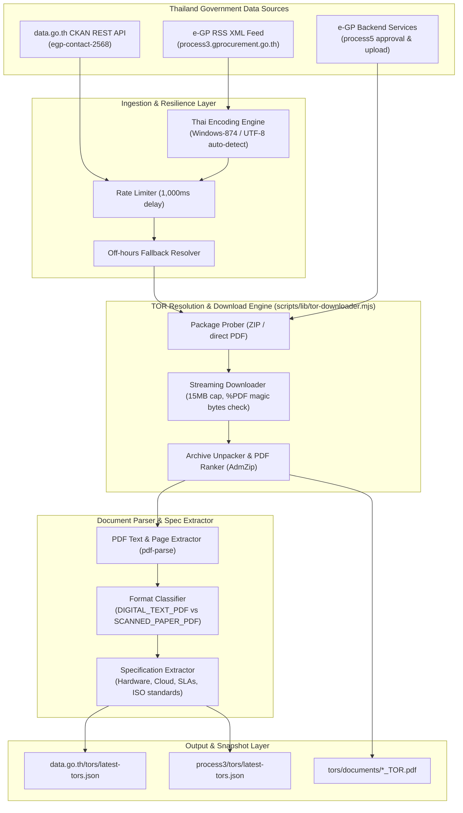

# GIPDP — Automated Government Procurement TOR Downloader & Parser Pipeline

[](https://nodejs.org/)
[](https://opensource.org/licenses/MIT)
[](https://nodejs.org/api/esm.html)
[](https://data.go.th)

An automated, resilient data extraction and document analysis pipeline for Thailand's official government procurement data sources:
1. **Open Government Data CKAN Datastore API (`data.go.th`)**
2. **Electronic Government Procurement (e-GP) RSS XML Feed (`process3.gprocurement.go.th`)**
3. **e-GP Document & Approval Backend Services (`process5.gprocurement.go.th`)**

The pipeline operates with test-size guardrails (configurable 1-by-1 processing), automatically resolving live procurement projects, retrieving authentic government TOR archives (ZIP/PDF), downloading documents with strict safety caps, detecting scanned paper vs. digital text PDFs, and parsing structured technical specifications (e.g., IT hardware, cloud resources, SLAs, and ISO standards).

---

## Architecture & Data Flow



---

## Key Features

- **Dual Government Data Integration**:
  - Connects to **data.go.th** CKAN Datastore API to query project-level contracts from fiscal year 2568 (`egp-contact-2568`) and historical summaries.
  - Connects to Thailand **e-GP RSS XML** feeds for live announcements across Draft TOR (`B0`), Invitation to Bid (`D0`), and Reference Price (`15`).
- **Authentic Document Package Resolution**:
  - Automatically queries official e-GP backend approval endpoints (`infoProcureDocAnnounZip` and `infoDocPriceestZipHis`).
  - Downloads genuine government ZIP archives via `egp-upload-service` and extracts the primary TOR or announcement PDF using a scored document-ranking algorithm.
- **Thai Character Encoding Resilience**:
  - Natively handles single-byte `Windows-874` / `TIS-620` and `UTF-8` feeds.
  - Automatically detects character corruption (Unicode replacement characters `\uFFFD` and Mojibake patterns like `เธ...`).
- **Scanned vs. Digital PDF Detection**:
  - Accurately identifies whether a document contains selectable digital text (`DIGITAL_TEXT_PDF`) or is a physical ink-signed scan requiring OCR (`SCANNED_PAPER_PDF`).
  - Employs companion text extraction from announcement files when the primary signed TOR is scanned.
- **Structured Specification Extraction**:
  - Converts Thai numerals (`๐-๙`) to Arabic digits (`0-9`).
  - Regex-driven spec extractor detects:
    - Item quantities and units (ชุด, เครื่อง, รายการ, ระบบ).
    - Device types (Notebook / Laptop, Desktop PC, Server / Data Center, Cloud Infrastructure).
    - Virtual machines (VMs), CPU cores, and RAM allocations.
    - Service Level Agreement (SLA) uptime percentages (e.g. 99.5%, 99.9%).
    - Industry certifications (ISO/IEC 27001, ISO/IEC 20000-1, CSA STAR, Tier 3).
    - Warranty and contract duration.
- **Safety & Operational Guardrails**:
  - **15 MB File Cap**: Prevents memory exhaustion or disk overrun.
  - **Magic Byte Verification**: Confirms valid `%PDF` headers before saving, preventing HTML error redirects from being stored as corrupt PDFs.
  - **Rate Limiting**: Strictly enforces 1,000ms delay between consecutive requests to respect government server resources.
  - **Weekend / Off-Hours Fallback**: If the live daily RSS feed returns 0 items during government non-business hours, automatically queries the active procurement catalog so the pipeline never breaks.
  - **Offline Mock Fixtures**: Built-in mock modes allow local or CI/CD testing without internet connectivity.

---

## Directory Structure

```text
.
├── .gitignore                      # Git ignore rules (node_modules, logs, cookies, temp)
├── package.json                    # Project configuration, scripts, and dependencies
├── README.md                       # Comprehensive documentation and usage guide
│
├── data.go.th/
│   ├── test-datago.mjs             # Automated 1-by-1 downloader & parser for data.go.th
│   └── tors/
│       ├── documents/              # Downloaded TOR PDF files (e.g., 68039469567_TOR.pdf)
│       ├── latest-tors.json        # Unified enriched JSON snapshot (Metadata + Specs)
│       └── tor-run-*.json          # Timestamped run logs
│
├── process3/
│   ├── test-process3.mjs           # Automated 1-by-1 downloader & parser for e-GP RSS
│   └── tors/
│       ├── documents/              # Downloaded TOR PDF files
│       ├── latest-tors.json        # Unified enriched JSON snapshot (Metadata + Specs)
│       └── tor-run-*.json          # Timestamped run logs
│
└── scripts/
    ├── lib/
    │   └── tor-downloader.mjs      # Shared PDF streaming downloader & parsing engine
    ├── test-api.mjs                # Standalone e-GP RSS connectivity & encoding tester
    └── test-apis.mjs               # Dual-suite connectivity tester (e-GP + data.go.th)
```

---

## Installation & Prerequisites

### Prerequisites
- **Node.js**: `v18.0.0` or higher
- **npm**: `v9.0.0` or higher

### Setup

```bash
# Clone the repository
git clone https://github.com/SivaponChannual/TOR_API_test.git
cd TOR_API_test

# Install dependencies
npm install
```

### Core Dependencies

| Package | Version | Purpose |
| :--- | :--- | :--- |
| [`axios`](https://www.npmjs.com/package/axios) | `^1.7.9` | HTTP client with binary arraybuffer streaming, custom headers, and timeouts |
| [`fast-xml-parser`](https://www.npmjs.com/package/fast-xml-parser) | `^4.5.3` | High-speed XML to JSON parser with array consistency rules |
| [`pdf-parse`](https://www.npmjs.com/package/pdf-parse) | `^2.4.5` | PDF text extraction, page counting, and document structure analysis |
| [`adm-zip`](https://www.npmjs.com/package/adm-zip) | `^0.6.0` | In-memory ZIP decompression to extract TOR PDFs from e-GP archives |

---

## CLI Usage & Commands

All pipelines can be run directly using `npm` scripts or executed via `node` with custom flags.

### 1. `data.go.th` Automated Downloader & Parser

Queries live e-GP project contracts from `data.go.th` (Fiscal Year 2568), locates live TOR attachment packages from the e-GP backend, downloads the PDF, and extracts specifications.

```bash
# Default: Downloads 1 computer/hardware TOR project
npm run test:datago

# Or run with custom search terms and limit:
node data.go.th/test-datago.mjs --q คอมพิวเตอร์ --limit 1
node data.go.th/test-datago.mjs --q คลาวด์ --limit 1
node data.go.th/test-datago.mjs --q ซอฟต์แวร์ --limit 2
```

**Options**:
- `--q <keyword>` : Keyword filter in Thai (default: `คอมพิวเตอร์`)
- `--limit <number>` : Number of projects with downloaded TORs to process (default: `1`)
- `--resourceId <id>` : Custom CKAN Datastore resource ID (default: `e4eaa1b4-eb1a-4534-b227-988ee25b898d`)

---

### 2. `process3` Automated Downloader & Parser

Queries live e-GP RSS XML feeds (`B0`, `D0`, `15`), resolves the project attachment, and processes the document. Includes automatic fallback to active procurement candidates during weekends and off-hours.

```bash
# Default: Queries live e-GP RSS for computer projects
npm run test:process3

# Or run with custom department code or keyword:
node process3/test-process3.mjs --q คอมพิวเตอร์ --limit 1
node process3/test-process3.mjs --q คลาวด์ --limit 1
node process3/test-process3.mjs --deptId 30501 --limit 1     # Target Bangkok Metropolitan Admin (BMA)
node process3/test-process3.mjs --deptId 02000 --limit 1     # Target Office of the Permanent Secretary
```

**Options**:
- `--q <keyword>` : Keyword filter for title and description (default: `คอมพิวเตอร์`)
- `--deptId <id>` : 5-digit government department code (default: all departments)
- `--limit <number>` : Maximum projects to download (default: `1`)

---

### 3. Endpoint Connectivity & Encoding Verification

Verify endpoint health, latency, Thai encoding integrity, and schema parsing across both data providers.

```bash
# Run standalone e-GP RSS verification
npm run test:rss

# Run comprehensive dual-endpoint test (e-GP RSS + data.go.th)
npm run test:connectivity

# Target a specific provider only
node scripts/test-apis.mjs --only egp
node scripts/test-apis.mjs --only datago

# Run in offline mock mode (uses realistic Thai procurement fixtures)
npm run test:mock
```

---

### 4. Run Full Pipeline

Executes both `process3` and `data.go.th` pipelines consecutively:

```bash
npm run test:all
```

---

## Output Data Structure

The primary output is written to `latest-tors.json` in each respective directory (`data.go.th/tors/latest-tors.json` and `process3/tors/latest-tors.json`).

### Sample Output Record

```json
{
  "source": "data.go.th",
  "dataset": "egp-contact-2568 (ข้อมูลโครงการจัดซื้อจัดจ้างจากระบบ e-GP ปีงบประมาณ 2568)",
  "query": "เช่า",
  "limit": 1,
  "totalMatchingProjects": 6894,
  "retrievedCount": 1,
  "fetchedAt": "2026-09-06T13:50:16.841Z",
  "tors": [
    {
      "projectId": "67089336878",
      "projectName": "ประกวดราคาเช่าเครื่องคอมพิวเตอร์กราฟิก Mac Pro ( เช่า 3 ปี) ด้วยวิธีประกวดราคาอิเล็กทรอนิกส์ (e-bidding)",
      "projectType": "เช่า",
      "fiscalYear": 2568,
      "agencyName": "องค์การกระจายเสียงและแพร่ภาพสาธารณะแห่งประเทศไทย(ส.ส.ท.)",
      "subAgencyName": "องค์การกระจายเสียงและแพร่ภาพสาธารณะแห่งประเทศไทย(ส.ส.ท.)",
      "province": "กรุงเทพมหานคร",
      "district": "ตลาดบางเขน",
      "procurementMethod": "ประกวดราคาอิเล็กทรอนิกส์ (e-bidding)",
      "announceDate": "5 ก.ย. 67",
      "transactionDate": "31 ต.ค. 67",
      "budgetTHB": 3840000,
      "medianPriceTHB": 3591027,
      "agreedPriceTHB": 3258792,
      "winnerName": "บริษัท ทูยู คอร์ปอเรชั่น จำกัด",
      "winnerTaxId": "0105564128418",
      "contractNo": "TPBS-Legal(R)010/2567",
      "contractSignDate": "31 ต.ค. 67",
      "contractEndDate": "27 ก.พ. 71",
      "projectStatus": "ระหว่างดำเนินการ",
      "egpProjectUrl": "https://process3.gprocurement.go.th/egp2procmainWeb/jsp/procsearch.sch?project_id=67089336878",
      "attachedDocument": {
        "fileName": "67089336878_TOR.pdf",
        "storagePath": "./data.go.th/tors/documents/67089336878_TOR.pdf",
        "sizeBytes": 106224,
        "originalEntryName": "Attach_TOR_1.pdf",
        "packageName": "67089336878_28082567.zip",
        "pages": 2,
        "documentType": "SCANNED_PAPER_PDF",
        "snippet": "Scanned document (physical ink signatures). OCR required for full text extraction.",
        "specs": {
          "deviceType": "Personal Computer (PC)"
        }
      },
      "source": "data.go.th (egp-contact-2568)",
      "fetchedAt": "2026-09-06T13:50:16.841Z"
    }
  ]
}
```

---

## Government Endpoints Reference

| Service | Protocol | Base URL / Endpoint | Parameters | Purpose |
| :--- | :--- | :--- | :--- | :--- |
| **data.go.th Datastore** | REST / JSON | `https://data.go.th/api/3/action/datastore_search` | `resource_id`, `q`, `limit` | Live procurement project database query |
| **e-GP RSS Feed** | RSS / XML | `https://process3.gprocurement.go.th/EPROCRssFeedWeb/egpannouncerss.xml` | `deptId`, `anounceType` (`B0`, `D0`, `15`) | Real-time daily procurement announcements |
| **e-GP Approval Service** | REST / JSON | `https://process5.gprocurement.go.th/egp-approval-service/apv-common/infoProcureDocAnnounZip` | `projectId` | Probes announcement ZIP packages |
| **e-GP Price Estimate** | REST / JSON | `https://process5.gprocurement.go.th/egp-doc-price-estimate-service/dpe-common/infoDocPriceestZipHis` | `projectId` | Probes price estimate & TOR ZIP packages |
| **e-GP Upload Download** | HTTP / Binary | `https://process5.gprocurement.go.th/egp-upload-service/v1/downloadFileTest` | `fileId` | Streams raw binary ZIP / PDF attachments |

---

## Git & GitHub Setup Guide

When you are ready to link and push this project to your GitHub repository:

```bash
# 1. Initialize git (if not already done)
git init

# 2. Stage all files (respecting .gitignore)
git add .

# 3. Create initial commit
git commit -m "feat: automated Thailand procurement TOR downloader and parser pipeline"

# 4. Set the main branch
git branch -M main

# 5. Link your GitHub remote repository
git remote add origin https://github.com/SivaponChannual/TOR_API_test.git

# 6. Push to GitHub
git push -u origin main
```

---

## Security & Privacy Guardrails

- **No Sensitive Credentials**: Government open data and e-GP endpoints used in this repository are public open-government interfaces; no private API secrets are required.
- **Session Cookie Exclusion**: Local session cookies (`cookies.txt`) and environment variables (`.env*`) are strictly ignored via [`.gitignore`](./.gitignore).
- **Portable Relative Paths**: All persisted metadata records use relative file paths for universal portability across developer environments and CI/CD pipelines.

---

## License

This project is licensed under the [MIT License](./package.json).
