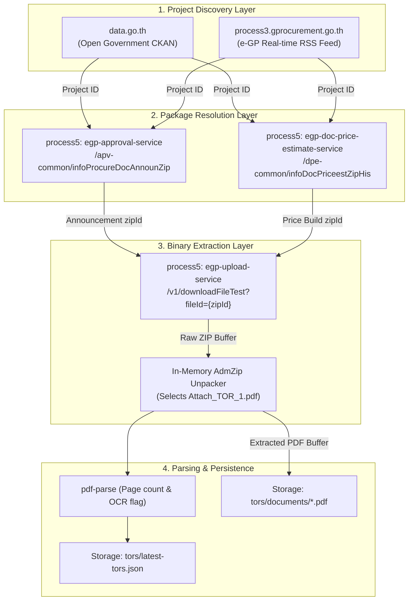
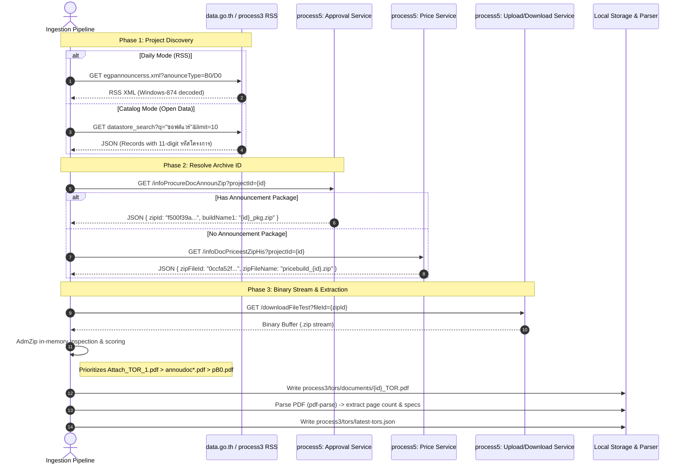

# Architecture & Data Flow: Thailand Government Procurement (e-GP)

This document provides a comprehensive technical overview of the systems involved in discovering, resolving, and extracting Thailand electronic Government Procurement (e-GP) Terms of Reference (TOR) documents.

---

## 1. Executive Summary & Component Roles

The Thai government procurement ecosystem is distributed across three primary hosts, each serving a distinct architectural role:



---

## 2. Deep Dive: The Three Government Systems

### A. `data.go.th` (Open Government Data Portal)

- **Owner / Host**: Digital Government Development Agency (DGA).
- **Core Technology**: CKAN Open Data Platform.
- **Protocol**: HTTP REST / JSON.
- **Primary Endpoint**: `https://data.go.th/api/3/action/datastore_search`
- **Target Dataset**: `egp-contact-2568` (`e4eaa1b4-eb1a-4534-b227-988ee25b898d` through `35961821-d945-4fc0-8ce1-a96b4cd46bd6`).

#### How it works:
1. Aggregates procurement awards, contracts, and tenders reported to the Comptroller General's Department (CGD).
2. Provides rich structured metadata:
   - `รหัสโครงการ` (11-digit Project ID)
   - `ชื่อโครงการ` (Project Title)
   - `ชื่อหน่วยงาน` (Government Agency / Ministry)
   - `งบประมาณ(บาท)` (Allocated Budget)
   - `ราคากลาง(บาท)` (Median Reference Price)
   - `วันที่ประกาศ` (Announcement Date)
3. **Crucial Limitation**: `data.go.th` **never hosts the actual document files or PDFs**. It is purely a catalog database.

---

### B. `process3.gprocurement.go.th` (e-GP Real-time RSS Feed)

- **Owner / Host**: Comptroller General's Department (CGD), Ministry of Finance.
- **Core Technology**: Java EE / BigIP Load Balancer.
- **Protocol**: RSS 2.0 XML.
- **Primary Endpoint**: `https://process3.gprocurement.go.th/EPROCRssFeedWeb/egpannouncerss.xml`
- **Parameters**: `anounceType` (`B0`, `D0`, `D1`, `15`, `P0`, `W0`), `deptId` (5-digit department code).
- **Character Encoding**: Thai Windows-874 / TIS-620.

#### Announcement Types Supported:
| Code | Thai Name | Description | Attachment Included? |
| :---: | :--- | :--- | :---: |
| **`B0`** | เผยแพร่ร่างประกาศและร่างเอกสารประกวดราคา | Draft TOR & Draft Bidding Documents | **Yes** (TOR PDF) |
| **`B1`** | ปรับปรุงร่างประกาศ | Revised Draft TOR (Comments period extended) | **Yes** (Revised TOR) |
| **`D0`** | ประกาศเชิญชวน | Official Invitation to Bid (e-bidding / tender) | **Yes** (Full Specification) |
| **`D1`** | เปลี่ยนแปลงประกาศเชิญชวน | Bidding Amendment / Date Extension | **Yes** (Amendment Notice) |
| **`D2`** | ประกาศผู้ชนะการเสนอราคา | Award Notice / Winning Bidder | Summary Only |
| **`15`** | ตารางแสดงวงเงินและราคากลาง | Reference Price Calculation Sheet | **Yes** (`pB0.pdf`) |
| **`P0` / `P1`** | แผนการจัดซื้อจัดจ้าง | Annual Procurement Plan | Summary Notice |
| **`W0` / `W1`** | ยกเลิกประกาศ | Tender Cancellation Notice | Summary Notice |

#### How it works:
1. Real-time stream of what government procurement officers post each business day.
2. Contains items with title, publication date, description, and link to the e-GP search query.
3. **Operational Caveats**:
   - `process3` issues HTTP 302 redirects to `process.gprocurement.go.th`.
   - During Thai government peak hours (09:00 - 11:30 ICT), the server frequently experiences heavy load and connection timeouts (>10s).
   - Only retains recent daily items (older projects cycle out).

---

### C. `process5.gprocurement.go.th` (e-GP Microservices & Document Vault)

- **Owner / Host**: CGD e-GP Phase 5 Production Cluster.
- **Core Technology**: Spring Cloud Microservices + Angular SPA (`egp-agpc01-web`).
- **Security Perimeter**: F5 BIG-IP Application Security Manager (WAF) + Cloudflare Turnstile.
- **Primary Document Endpoints**:
  - Announcement Package: `GET /egp-approval-service/apv-common/infoProcureDocAnnounZip?projectId={id}`
  - Price Estimate Package: `GET /egp-doc-price-estimate-service/dpe-common/infoDocPriceestZipHis?projectId={id}`
  - Binary Downloader: `GET /egp-upload-service/v1/downloadFileTest?fileId={zipId}`

#### How it works:
1. When government agencies submit procurement packages, they upload a zipped archive containing all legal forms and TORs.
2. The web portal search (`egp-agpc01-web`) is protected by Cloudflare Turnstile captcha and encrypted parameters (`U2Fs...`).
3. However, the **document resolution microservices accept direct REST queries** when provided with standard browser user-agent and origin headers.
4. The binary endpoint streams the exact official `.zip` file stored by the government.

---

## 3. End-to-End Data Flow Sequence



---

## 4. Inside the Government ZIP Package

When e-GP packages an announcement, it bundles all related procurement documentation together:

```text
68069160377_19062568_1.zip (Example: SAP ERP Software Tender)
├── Attach_TOR_1.pdf         <-- [TARGET] Full TOR Scope of Work (34 pages)
├── annoudoc_5030100000.pdf   <-- Official announcement letter
├── doc_5030100000.pdf        <-- Terms & bidding conditions
├── bidding noltice.pdf       <-- Bidding notice summary
├── pB0.pdf                   <-- Median price / Reference budget breakdown
├── quotation.pdf             <-- Vendor pricing bid form
├── Bid Bond.pdf              <-- Bid security template
├── Advance Payment Bond.pdf  <-- Guarantee template
└── action_plan.xlsx          <-- Work delivery schedule template
```

Our document ranker automatically isolates `Attach_TOR_1.pdf` and ignores the generic bond templates.

---

## 5. Security & Network Considerations

1. **WAF Bypass (F5 BIG-IP ASM)**:
   - Requesting `process5` with short or bot-like User-Agents (e.g. `curl`, `axios`, `Mozilla/5.0`) triggers an immediate WAF rejection (`Request Rejected - Support ID <xxxxxx>`).
   - Requests must send authentic Chrome browser headers:
     ```javascript
     {
       'User-Agent': 'Mozilla/5.0 (Macintosh; Intel Mac OS X 10_15_7) AppleWebKit/537.36 (KHTML, like Gecko) Chrome/120.0.0.0 Safari/537.36',
       'Referer': 'http://process.gprocurement.go.th/egp2procmainWeb/procsearch.sch',
       'Origin': 'http://process.gprocurement.go.th',
       'Accept': '*/*'
     }
     ```

2. **Rate Limiting**:
   - Enforce minimum `1,000ms` delay between consecutive requests to avoid throttling.

3. **Size Safety Caps**:
   - Downloads are capped at `15MB` max to prevent disk bloat during test and automated runs.
